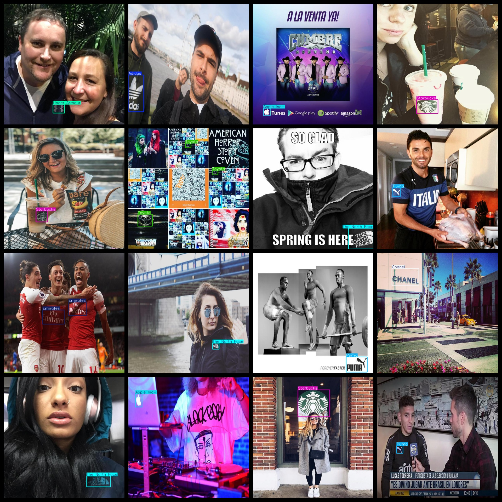
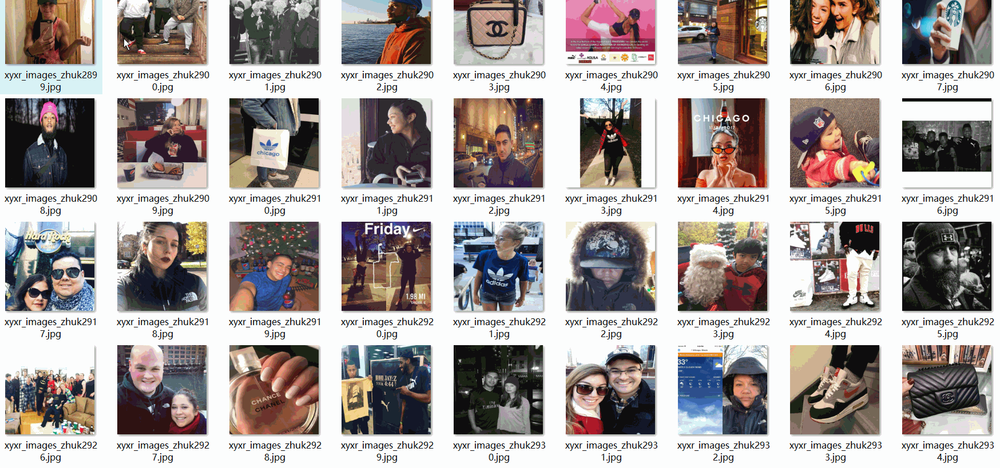

# 15 typesLogo Detection Dataset 9626 imagesVOC+YOLO format

The 15 logo detection datasets are 9626 VOC+YOLO format.

Dataset format: Pascal VOC format + YOLO format (the txt file does not contain the split path, it only contains jpg images and corresponding VOC format xml files and yolo format txt files)

Number of images (number of jpg files): 9626

Number of XML Files: 9626

Number of txt files: 9626

Category count: 15

The Github repository is: datasets_sl

["Adidas", "Apple Inc-", "Chanel", "Coca-Cola", "Emirates", "Hard Rock Cafe", "Mercedes-Benz", "NFL", "Nike", "Pepsi", "Puma", "Starbucks", "The North Face", "Toyota", "Under Armour"]

Tags: adidas, Apple Inc., Chanel, Coca-Cola, Emirates Airline, Hard Rock Cafe, Mercedes-Benz, NFL (National Football League), Nike, Pepsi, Puma, Starbucks, The North Face, Toyota, Under Armour

Number of boxes labeled in each category:

Adidas Frame Count = 1066

Apple Inc- Frames = 664

The number of Chanel frames is 702.

Coca-Cola frame count = 929

Emirates Frames = 725

Hard Rock Cafe Frame Count = 648

Mercedes-Benz frame count = 744

NFL frame count = 901

Nike Frame Count = 1073

Pepsi frame count = 597

Puma Frames = 854

Starbucks frame count = 894

The North Face frame count = 771

Toyota frame count = 681

Under Armour frame count = 754

Total number of frames: 12003

Number of images per category:

Adidas owns 872 images.

Apple Inc-Occupies Image Count = 635

The number of Chanel pictures is 562.

Coca-Cola's image count = 731

Emirates have 539 images.

Hard Rock Cafe occupies a total of 549 images.

Mercedes-Benz owns 686 pictures.

NFL has 761 images

Nike's occupancy rate = 866

Pepsi owns 443 images.

Puma occupies the picture count = 713

Starbucks occupies 802 images.

The North Face has 730 images.

Toyota occupies the image count = 569

Under Armour's possession of images = 694

Image resolution: 640x640

Use the labeling tool: labelImg

Dataset Augmentation: No

Rules for annotation: Draw a rectangle around the category.

Important note: The dataset does not have been divided into training, validation, and testing sets.

Special Disclaimer: This dataset does not guarantee the accuracy of the trained models or weight files.

Annotation and image details are as follows:

## Images

---

Here is a pay link on Stripe (https://buy.stripe.com/3cs8yP7sY87d0vu9AB). Please contact me lonlonago@foxmail.com after funding $89, and I will send you a complete data files, thank you!

